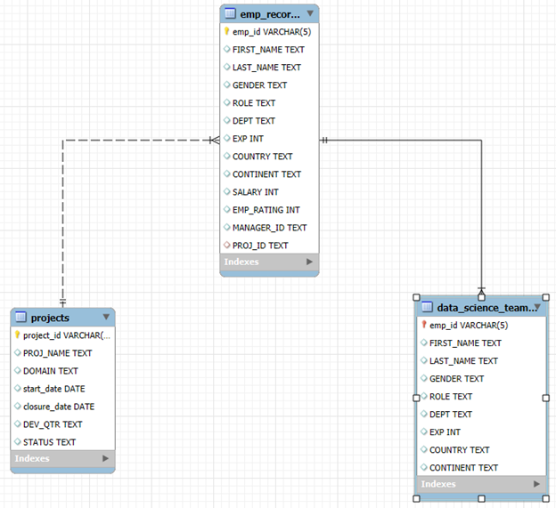
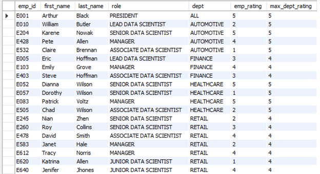
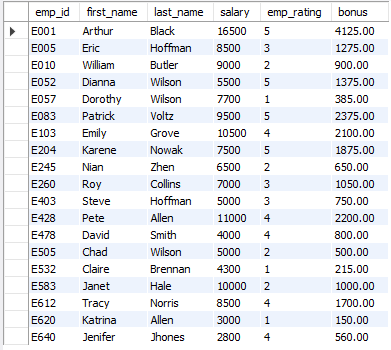
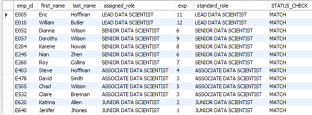

# Employee Workforce Analytics with SQL

## Overview

This project analyzes an employee database to support performance evaluation and workforce planning for a data science company.

Using SQL, the analysis focuses on:
- Employee performance ratings  
- Salary and bonus calculations  
- Reporting structure  
- Role alignment based on experience  

The goal is to generate insights that help HR make informed decisions during the employee appraisal process.

---

## Tools Used

- SQL (MySQL)
- Data Modeling (ER Diagram)

---

## Dataset

The dataset includes:
- Employee records (demographics, salary, experience, ratings)
- Project assignments  
- Data science team roles  

## ER Diagram

  
---

## Key Analyses

### Employee Performance Analysis
- Segmented employees based on performance ratings  
- Identified high and low performers  

### Department-Level Insights
- Compared employee ratings within departments  
- Calculated maximum ratings per department  

### Reporting Structure
- Identified managers with direct reports  
- Counted number of employees per manager  

### Salary & Bonus Analysis
- Calculated employee bonuses using:
```sql
(salary * 0.05) * emp_rating
```
- Analyzed salary distribution across regions

### Experience-Based Ranking
- Ranked employees based on experience

### Role Validation
- Created a stored function to validate role alignment with experience
```sql
IF(role = GetStandardProfile(EXP), 'MATCH', 'MISMATCH')
```

## Key Insight

A custom SQL function was used to compare assigned roles with expected roles based on experience. This helps identify employees who may need training or role adjustments.

## SQL Skills Demonstrated
- Joins & subqueries
- Aggregate functions
- Window functions
- Views & indexing
- Stored functions
- Data validation logic

## Sample Outputs

```sql
-- Display each employee's details with the maximum EMP_RATING in their department
SELECT
    emp_id,
    first_name,
    last_name,
    role,
    dept,
    emp_rating,
    MAX(emp_rating) OVER (
		PARTITION BY dept) AS max_dept_rating
FROM emp_records;
```
  

---

```sql
-- Calculate bonus for all employees based on ratings and salaries
-- Formula: 5% of salary * employee rating
SELECT
    emp_id,
    first_name,
    last_name,
    salary,
    emp_rating,
    (salary * 0.05) * emp_rating AS bonus
FROM emp_records;
```
  

---

```sql
-- 13. Create a stored function to validate whether assigned job profiles
-- match the organization's standard based on experience.

DELIMITER //

CREATE FUNCTION GetStandardProfile(exp INT)
RETURNS VARCHAR(50)
DETERMINISTIC
BEGIN
    DECLARE standard_role VARCHAR(50);

    CASE
        WHEN exp <= 2 THEN
            SET standard_role = 'JUNIOR DATA SCIENTIST';
        WHEN exp > 2 AND exp <= 5 THEN
            SET standard_role = 'ASSOCIATE DATA SCIENTIST';
        WHEN exp > 5 AND exp <= 10 THEN
            SET standard_role = 'SENIOR DATA SCIENTIST';
        WHEN exp > 10 AND exp <= 12 THEN
            SET standard_role = 'LEAD DATA SCIENTIST';
        ELSE
            SET standard_role = 'MANAGER';
    END CASE;

    RETURN standard_role;
END //

DELIMITER ;

SELECT
    emp_id,
    first_name,
    last_name,
    role AS assigned_role,
    exp,
    GetStandardProfile(exp) AS standard_role,
    IF(role = GetStandardProfile(exp), 'MATCH', 'MISMATCH') AS status_check
FROM data_science_team;
```
  

Other relevant files and assets are included in the repository.  
Feel free to explore the different analyses and insights extracted from the provided data.
